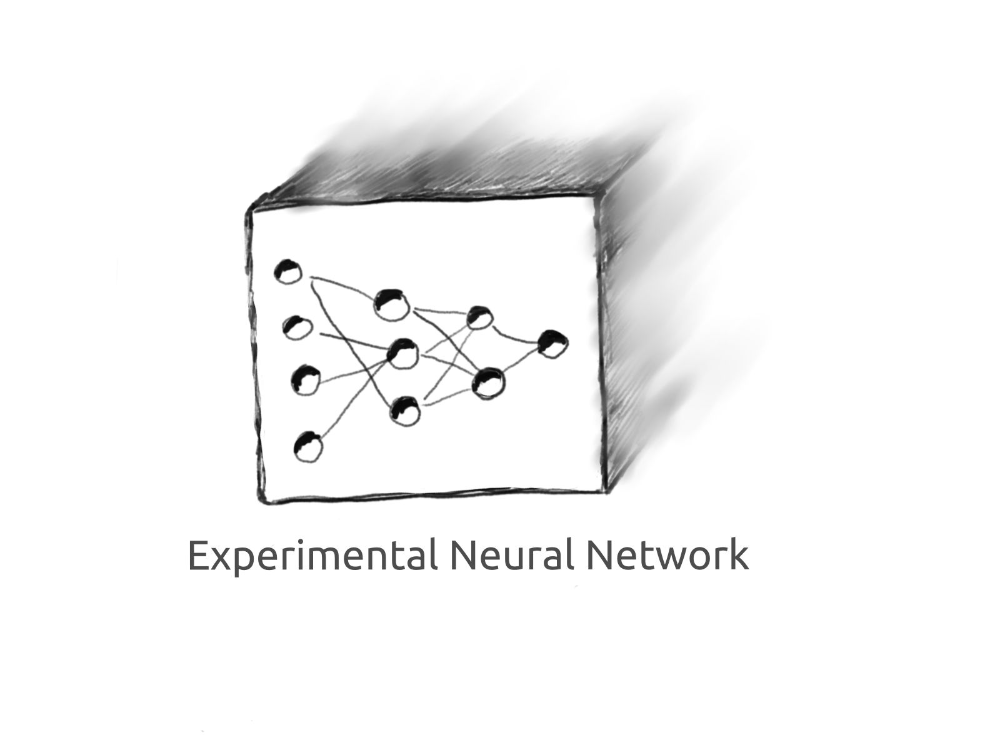

## golang Experimental Neural Network
### by Eugene Shashkov

- Attempt to create Neural Network with golang

- Very raw functionality, do not use this library

```
go run examples/basic_usage.go
Test Prediction Expected: [1] [7.767853728983342]
Test Prediction Expected: [10] [9.828197338867309]
```

```
Test Prediction Expected: [2] [2.3847168327596195]
Test Prediction Expected: [30] [34.932009101148594]
Test Prediction Expected: [200] [236.48489696841472]
final loss:  0.00038216514535771573

// cd examples
// go run main.go
```